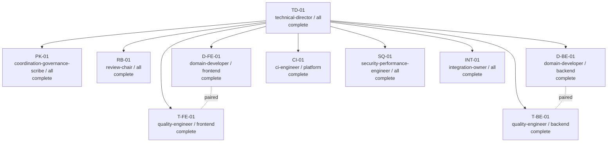

# Company Swarm Dashboard — example-run-001

| Field | Value |
|---|---|
| Status | `COMPANY_SWARM_ACCEPTED` |
| Generation | 2 |
| Current Gate | `G5` |
| Coordination state/version | `ACCEPTED` / 41 |
| Director epoch | 2 |
| Shared Pack | `pack-6` |
| Requested model | `gpt-5.6-sol` |
| Reasoning effort | `max` |
| Identity confidence | `configured` |
| Sessions | 10 total; complete=10 |
| Features | 3/3 accepted or complete (100.0%) |

## Durable coordination

| Control | Value |
|---|---|
| Notion mode | `DIRECT_WRITABLE` |
| Schema state | `READY` |
| Sync status | `IN_SYNC` |
| Event watermark / latest | 41 / 41 |
| Pending outbox | 0 |
| Dead letters | 0 |
| Last receipt | `WR-041` |
| Checkpoint | `CP-041` at event 41 |
| Resume token | `resume:example-run-001:41:2` |
| Traceability | `PASS` (9 requirements, 3 features) |
| Open context requests | 0 |
| Stale Pack/epoch results rejected | 2 |

## Organization

| Session | Role | Domain | State | Pair |
|---|---|---|---|---|
| TD-01 | technical-director | all | complete | — |
| PK-01 | coordination-governance-scribe | all | complete | — |
| RB-01 | review-chair | all | complete | — |
| D-FE-01 | domain-developer | frontend | complete | T-FE-01 |
| T-FE-01 | quality-engineer | frontend | complete | D-FE-01 |
| D-BE-01 | domain-developer | backend | complete | T-BE-01 |
| T-BE-01 | quality-engineer | backend | complete | D-BE-01 |
| CI-01 | ci-engineer | platform | complete | — |
| SQ-01 | security-performance-engineer | all | complete | — |
| INT-01 | integration-owner | all | complete | — |

## Feature delivery

| Feature | Type | Lane | Status |
|---|---|---|---|
| FEAT-1 — Recommendation API | implement | backend | accepted |
| FEAT-2 — Recommendation UI | implement | frontend | accepted |
| FEAT-3 — Feed latency | performance | backend | accepted |

## MFSQ evidence

| Axis | Passed | Failed | Blocked | N/A | Pass rate |
|---|---:|---:|---:|---:|---:|
| M | 8 | 0 | 0 | 0 | 100.0% |
| F | 31 | 0 | 0 | 0 | 100.0% |
| S | 12 | 0 | 0 | 1 | 100.0% |
| Q | 9 | 0 | 0 | 0 | 100.0% |

## CI/CD

| Field | Value |
|---|---|
| Provider | jenkins |
| Pipeline | stylemuse/main |
| Run ID | 411 |
| Candidate | abc123 |
| Status | PASS |
| Duration (s) | 812 |
| Job pass rate | 14/14 (100.0%) |
| Artifacts | junit.xml, security.sarif, performance.json |

## Security

| Critical | High | Medium | Low | Unresolved |
|---:|---:|---:|---:|---:|
| 0 | 0 | 1 | 3 | 0 |

## Performance

| Metric | Baseline | Candidate | Threshold | Result |
|---|---:|---:|---|---|
| feed p95 latency | 530 ms | 410 ms | <= 450 ms | PASS |
| web LCP p75 | 2.8 s | 2.2 s | <= 2.5 s | PASS |

## Review history

| Gate | Generation | Verdict |
|---|---:|---|
| G0 | 1 | GO_WITH_ACTIONS |
| G4 | 1 | RETURN_TO_LANE |
| G4 | 2 | ACCEPT |

Ownership violations: **0**

## Residual risks

- **low / accepted-residual:** Performance baseline uses one test-cluster shape

## PKOS writeback

- Status: `CONFIRMED`
- Changed nodes/rows: `FEAT-1`, `FEAT-2`, `DEC-14`, `AUD-88`
- Write receipts: `WR-038`, `WR-039`, `WR-040`

_Generated from durable run-state and coordination artifacts; verify referenced commits, CI reports, checksums, Event Ledger watermark, and Notion receipts before relying on this dashboard._
